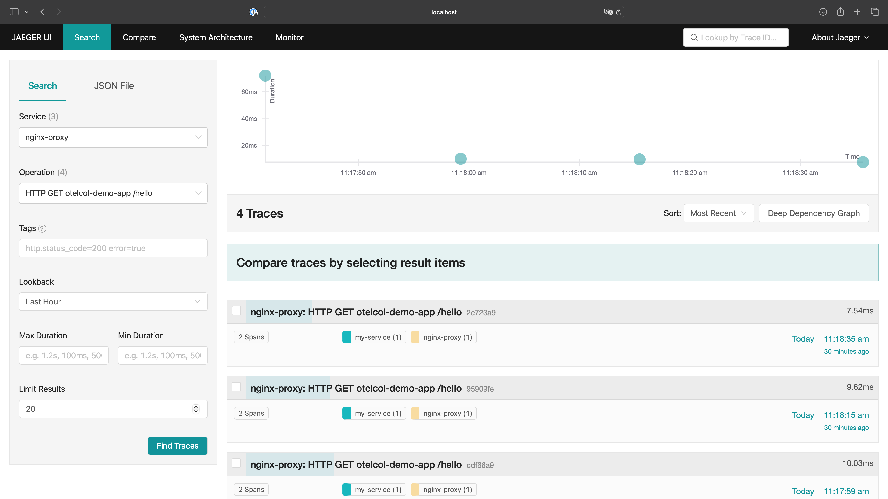

# Opentelemetry/Jaeger with Nginx Ingress Controller PoC

## Prerequisite
- Kubernetes Cluster
- Kubectl
- Helm

## Step

1. Install Nginx Ingress with custom value for enabling the Opentelemetry
```
$ helm upgrade --install ingress-nginx ingress-nginx \
  --repo https://kubernetes.github.io/ingress-nginx \
  --namespace ingress-nginx --create-namespace \
  --set controller.opentelemetry.enable=true
```

2. Enable OpenTelemetry and set the otlp-collector-host
```
$ echo '
  apiVersion: v1
  kind: ConfigMap
  data:
    enable-opentelemetry: "true"
    opentelemetry-config: "/etc/nginx/opentelemetry.toml"
    opentelemetry-operation-name: "HTTP $request_method $service_name $uri"
    opentelemetry-trust-incoming-span: "true"
    otlp-collector-host: "<otel collector host>" #example="otel-coll-collector.otel.svc"
    otlp-collector-port: "4317"
    otel-max-queuesize: "2048"
    otel-schedule-delay-millis: "5000"
    otel-max-export-batch-size: "512"
    otel-service-name: "nginx-proxy" # Opentelemetry resource name
    otel-sampler: "AlwaysOn" # Also: AlwaysOff, TraceIdRatioBased
    otel-sampler-ratio: "1.0"
    otel-sampler-parent-based: "false"
  metadata:
    name: ingress-nginx-controller
    namespace: ingress-nginx
  ' | kubectl replace -f -
```

3. Deploy otel-collector & Jaeger backend:
```
# Deploy cert-manager needed for OpenTelemetry collector operator
$ helm repo add jetstack https://charts.jetstack.io --force-update
$ helm repo update
$ helm install \
  cert-manager jetstack/cert-manager \
  --namespace cert-manager \
  --create-namespace \
  --version v1.14.5 \
  --set installCRDs=true

# install OpenTelemetry collector operator
$ helm repo add open-telemetry https://open-telemetry.github.io/opentelemetry-helm-charts
$ helm repo update
$ helm install opentelemetry-operator open-telemetry/opentelemetry-operator \
--set "manager.collectorImage.repository=otel/opentelemetry-collector-k8s" \
--set admissionWebhooks.certManager.enabled=false \
--set admissionWebhooks.autoGenerateCert.enabled=true

# Deploy OpenTelemetry collector
$ kubectl apply -f - <<EOF
apiVersion: opentelemetry.io/v1alpha1
kind: OpenTelemetryCollector
metadata:
  name: otel-coll
  namespace: opentelemetry-operator-system
spec:
  mode: deployment
  config: |
    receivers:
      otlp:
        protocols:
          grpc:
          http:
    processors:
    exporters:
      otlp:
        endpoint: jaeger-all-in-one-collector.observability.svc:4317
        tls:
          insecure: true
    service:
      telemetry:
        logs:
          level: "debug"
      pipelines:
        traces:
          receivers: [otlp]
          processors: []
          exporters: [otlp]
EOF

# create observability namespace
$ kubectl create ns observability

# deploy Jaeger all-in-one
$ kubectl apply -f https://github.com/jaegertracing/jaeger-operator/releases/download/v1.37.0/jaeger-operator.yaml -n observability
$ kubectl apply -f https://raw.githubusercontent.com/esigo/nginx-example/main/observability/jaeger.yaml -n observability
```

4. Deploy demo app
```
$ kubectl apply -f - <<EOF
apiVersion: apps/v1
kind: Deployment
metadata:
  labels:
    app: otelcol-demo-app
  name: otelcol-demo-app
  namespace: myapp
spec:
  replicas: 1
  selector:
    matchLabels:
      app: otelcol-demo-app
  template:
    metadata:
      labels:
        app: otelcol-demo-app
    spec:
      containers:
        - image: quay.io/rbaumgar/otelcol-demo-app-jvm
          imagePullPolicy: IfNotPresent
          name: otelcol-demo-app
          env:
            - name: OTELCOL_SERVER
              value: "http://otel-coll-collector.opentelemetry-operator-system.svc:4317"

---
apiVersion: v1
kind: Service
metadata:
  labels:
    app: otelcol-demo-app
  name: otelcol-demo-app
  namespace: myapp
spec:
  ports:
    - port: 8080
      protocol: TCP
      targetPort: 8080
      name: web
  selector:
    app: otelcol-demo-app
  type: LoadBalancer

---

apiVersion: networking.k8s.io/v1
kind: Ingress
metadata:
  name: myapp-ingress
  namespace: myapp
spec:
  ingressClassName: nginx
  rules:
  - host: <hostname> #nginx.gun.local
    http:
      paths:
      - backend:
          service:
            name: otelcol-demo-app
            port:
              number: 8080
        path: /
        pathType: Prefix
EOF
```

5. [Optional] If you use Kubernetes Cluster in Local, Add host in /etc/hosts for accessing the ingress host

```
127.0.0.1       <hostname> #nginx.gun.local
```

6.  Try to request the website
```
curl <hostname>/hello
```

7. Access the Jaeger UI
```
$ kubectl port-forward --namespace=observability service/jaeger-all-in-one-query 16686:16686
```



### Reference
- https://kubernetes.github.io/ingress-nginx/user-guide/third-party-addons/opentelemetry

- https://medium.com/@akashjoffical08/implement-distributed-tracing-with-jaeger-opentelemetry-on-kubernetes-3e35cb77b536